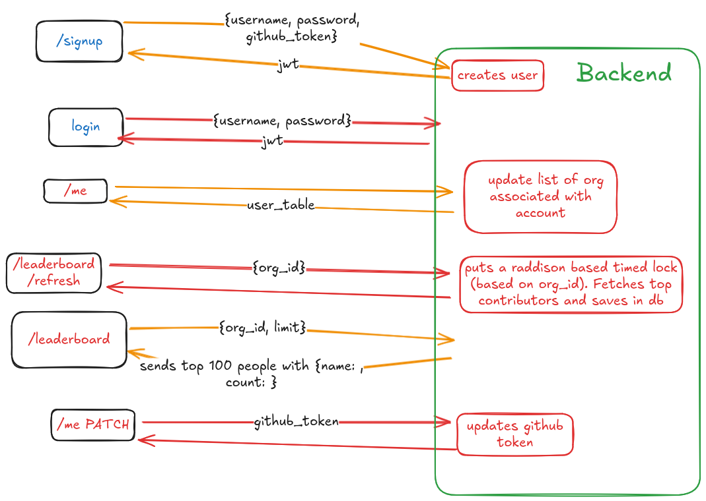

# GitHub Organization Leaderboard Platform

[](https://www.java.com)
[](https://spring.io/projects/spring-boot)
[](https://www.docker.com/)
[](https://www.mysql.com/)
[](https://redis.io/)
[](https://jwt.io/)
[](https://gradle.org/)

A robust springboot based backend platform designed to provide insightful analytics and a competitive leaderboard for GitHub organizations. This application empowers users to track contributor activity, identify top performers, and gain a deeper understanding of their open-source or private projects.

## Key Features

- **Enterprise grade:** Uses all conventions utilized by springboot to separate data layer from business logic from controllers.
- **Secure User Authentication:** Implements JWT-based authentication with Spring Security for secure access to the platform.
- **GitHub Organization Integration:** Seamlessly connects with the GitHub API to fetch data about organizations, repositories, and contributors.
- **Contributor Leaderboard:** A core feature that ranks contributors based on their commits, providing a clear view of top performers across an organization's repositories.
- **RESTful API:** A well-documented and easy-to-use RESTful API for all platform functionalities.
- **Scalable & Containerized:** The entire application is containerized using Docker and managed with Docker Compose, ensuring easy deployment, scalability, and environment consistency.
- **Database Migrations:** Utilizes Flyway for version-controlled database schema management, making it easy to track and apply database changes.
- **Redis Lock & Distributed Locking:** Leverages Redisson to implement Redis-based distributed locks that safely serialize access to the heavy-duty /leaderboard/refresh route, preventing simultaneous leaderboard creation requests and ensuring data consistency during concurrent operations.

## Architecture & Workflow

The application follows a modern, containerized architecture. The core is a Spring Boot application that communicates with a MySQL database for persistent storage and a Redis instance for caching. The `flow.png` diagram below illustrates the high-level workflow of the application.



## Database Diagram


## Technologies Used

### Backend

- **Java 21**
- **Spring Boot 3.2.0**
  - Spring Web
  - Spring Data JPA
  - Spring Security
- **MySQL 8.0:** Primary relational database.
- **Redis 7.0:** In-memory data store for caching.
- **Redisson:** Advanced Redis client for Java.
- **Flyway:** Database migration tool.
- **JJWT:** Java library for JWT creation and validation.
- **Lombok:** To reduce boilerplate code.

### DevOps & Tooling

- **Docker & Docker Compose:** For containerization and orchestration.
- **Gradle:** Dependency management and build automation.
- **Git:** Version control.

## Getting Started

### Prerequisites

- Docker and Docker Compose installed on your machine.
- A `.env` file in the project root.

### Installation & Setup

1.  **Clone the repository:**

    ```bash
    git clone https://github.com/abhitrueprogrammer/gh-org-tools.git
    cd gh-org-tools
    ```

2.  **Create a `.env` file** in the root of the project. Refer to .env.example.

3.  **Run the application with Docker Compose:**
    This single command will build the Spring Boot application image, and start the application, MySQL, and Redis containers.
    ```bash
    docker-compose up --build
    ```

The application will be accessible at `http://localhost:8080`.

## Future Enhancements

As outlined in the `roadmap.md`, the future vision for this project includes:

- **Improved Scalability:** Implementing a message queue (e.g., RabbitMQ, Kafka) for asynchronous processing of leaderboard generation jobs.
- **Additional GitHub Tools:** Build more tools leveraging the GitHub API to help manage and automate tasks within your GitHub organization.